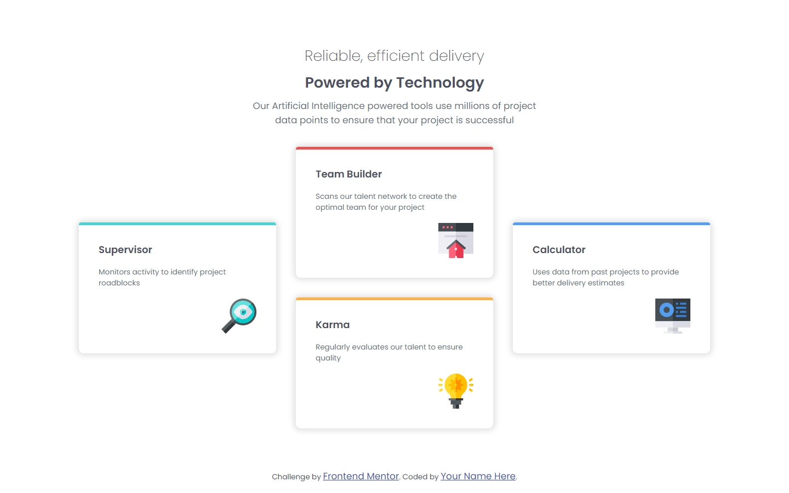

# Frontend Mentor - Four card feature section solution

This is a solution to the [Four card feature section challenge on Frontend Mentor](https://www.frontendmentor.io/challenges/four-card-feature-section-weK1eFYK). Frontend Mentor challenges help you improve your coding skills by building realistic projects.

## Table of contents

- [Overview](#overview)
  - [The challenge](#the-challenge)
  - [Screenshot](#screenshot)
  - [Links](#links)
- [My process](#my-process)
  - [Built with](#built-with)
  - [What I learned](#what-i-learned)
  - [Continued development](#continued-development)
- [Author](#author)

## Overview

### The challenge

Users should be able to:

- View the optimal layout for the site depending on their device's screen size

### Screenshot



### Links

- Solution URL: [https://github.com/david-franca/four-card-feature-section](https://github.com/david-franca/four-card-feature-section)
- Live Site URL: [https://four-card-feature-section-nu-ruddy.vercel.app/](https://four-card-feature-section-nu-ruddy.vercel.app/)

## My process

### Built with

- Semantic HTML5 markup
- CSS custom properties
- Flexbox
- CSS Grid

### What I learned

I was able to study a little more about CSS selectors and how to use them to create creative layouts with few elements on the screen.

For example, the use of :nth-child and ::before

```css
.card:nth-child(1) {
  grid-row: 1 / 3;
  grid-column: 1 / 2;

  &::before {
    background-color: var(--cyan);
  }
}
```

### Continued development

In this simple project, I was able to see how there is still so much about CSS that I still don't know and that is very useful. CSS selectors and functions are very useful and it is worth studying a little more about them.

## Author

- Website - [David França](https://davidfranca.vercel.app/)
- Frontend Mentor - [@david-franca](https://www.frontendmentor.io/profile/david-franca)
